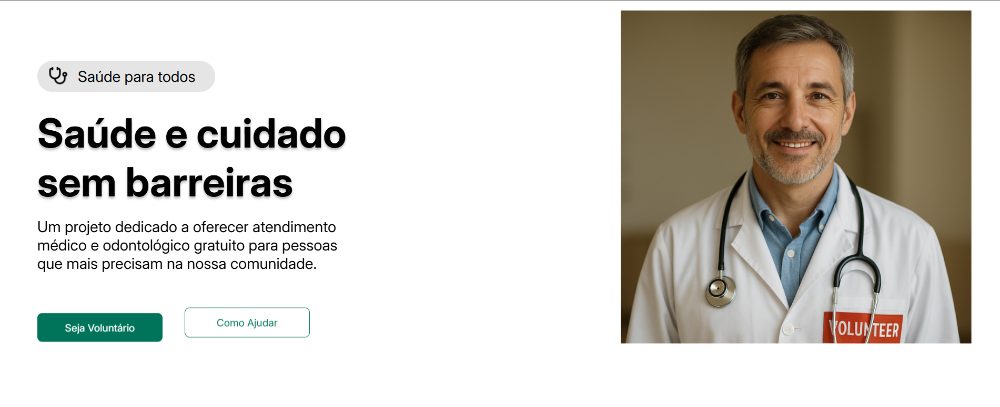

# Saúde para Todos

> **Saúde e cuidado sem barreiras** > Um projeto dedicado a oferecer atendimento médico e odontológico gratuito para pessoas que mais precisam na nossa comunidade.

## 🩺 Sobre o Projeto

**Saúde para Todos** é uma iniciativa social focada em promover o acesso universal à saúde de qualidade. O projeto conecta profissionais voluntários da área da saúde a pessoas em situação de vulnerabilidade, oferecendo atendimento médico e odontológico gratuito, humano e acessível.

Nosso propósito é simples e poderoso: **cuidar de pessoas, sem barreiras financeiras ou sociais**.

## 🎯 Nossa Missão

**Transformar vidas através do acesso universal à saúde de qualidade.**

Trabalhamos diariamente para garantir que o cuidado com a saúde seja um direito real e acessível a todos.

## 🌍 Nossos Pilares

### 🤝 Acesso Equitativo

Garantir que todos tenham acesso a cuidados de saúde de qualidade, independentemente de sua condição financeira.

### 🧑‍⚕️ Comunidade Forte

Construir uma rede de profissionais de saúde dedicados a servir com compaixão, empatia e profissionalismo.

### 💙 Bem-estar Total

Oferecer atendimento integral em medicina geral e odontologia, promovendo mais qualidade de vida e prevenção.

## 🙋‍♂️ Seja Voluntário

Profissionais da saúde podem fazer parte dessa transformação. Se você é médico, dentista ou atua na área da saúde e deseja ajudar, sua contribuição pode mudar vidas.

**Como ajudar:**

- Atendimentos voluntários
- Apoio em campanhas comunitárias
- Divulgação do projeto

## 📊 Nosso Impacto

**Transformando a saúde da nossa comunidade, um paciente de cada vez.**

- **2.500+** pessoas atendidas
- **150+** profissionais voluntários
- **98%** de satisfação dos pacientes
- **5+ anos** de dedicação contínua

## 🖼️ Identidade Visual

- Ícone minimalista de um **estetoscópio preto**
- Fundo **transparente**
- Linguagem visual simples, humana e acessível

## 📄 Licença

Este projeto é de caráter social e comunitário. Consulte o responsável pelo projeto para mais informações sobre uso, contribuições ou parcerias.

## ❤️ Agradecimentos

A todos os voluntários, parceiros e pacientes que acreditam que **saúde é um direito de todos**.
Juntos, seguimos cuidando de vidas.
